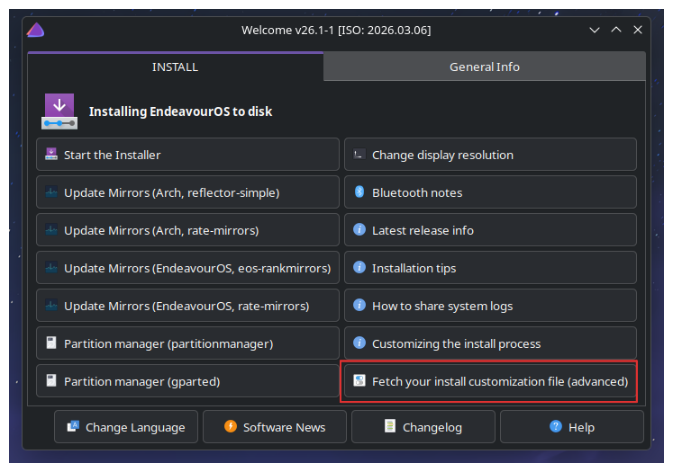
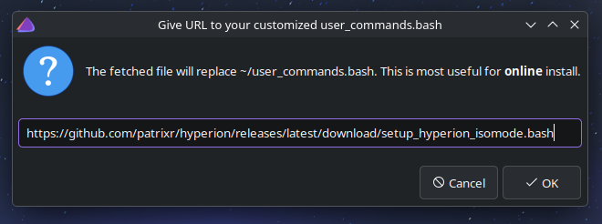
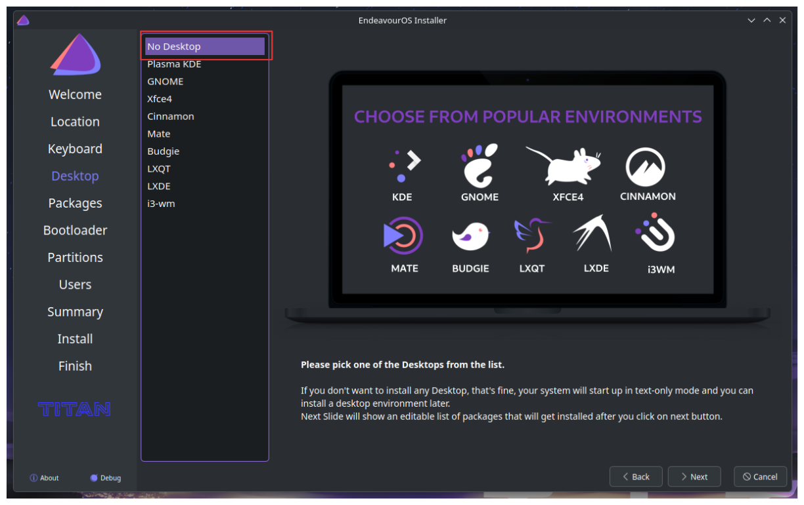

# Installation Guide

This guide will walk you through installing Hyperion during the EndeavourOS installation process.

---

## Prerequisites

- EndeavourOS live ISO (download from [endeavouros.com](https://endeavouros.com))
- Bootable USB drive with EndeavourOS

---

## Installation Steps

### Step 1: Fetch Your Install Customization File

In the live environment, open the **EndeavourOS Installer** and choose **"Fetch your install customization file"**.



### Step 2: Paste the Hyperion Installation URL

Type or paste the URL for the Hyperion setup script:

```
https://github.com/patrixr/hyperion/releases/latest/download/setup_hyperion_isomode.bash
```



Click **OK**, then back in the **EndeavourOS Installer** click **Start the Installer** and proceed with an online installation.

### Step 3: Select "No Desktop"

During the installation, when you reach the desktop environment selection screen, be sure to choose **"No desktop"** since Hyperion will install and configure everything needed (Niri compositor, SDDM, Noctalia shell, and Ghostty terminal).



### Step 4: Complete the Installation

Continue with the rest of the EndeavourOS installation process:
- Configure your timezone
- Create your user account
- Configure your disk partitions
- Complete the installation

The Hyperion setup will run automatically during the installation process.

---

## Post-Installation

After installation completes and you reboot:

1. You'll be greeted by the SDDM login manager with the custom Hyperion theme
2. Log in with your user credentials
3. Niri compositor will launch with Noctalia shell
4. Press your configured keybinding to open Ghostty terminal (default Nushell)

---

## Manual Installation (Post-Install)

If you already have EndeavourOS installed, you can install Hyperion manually:

```bash
# Install latest stable release
curl -sL https://github.com/patrixr/hyperion/releases/latest/download/hyperion.sh | sudo bash

# Install a specific version
curl -sL https://github.com/patrixr/hyperion/releases/download/v0.1.1/hyperion.sh | sudo bash
```

Or clone and run locally:

```bash
git clone --depth=1 https://github.com/patrixr/hyperion.git
cd hyperion
sudo ./hyperion.sh
```

---

## What Gets Installed

Hyperion installs and configures the following components:

- **Niri** - Scrollable-tiling Wayland compositor
- **SDDM** - Display manager with custom theme
- **Noctalia Shell** - Wayland shell for managing windows and UI
- **Ghostty** - Modern GPU-accelerated terminal
- **Nushell** - Default shell with modern scripting capabilities
- **Custom configs** - Pre-configured settings for all components
- **Wallpapers** - Curated background images

All configurations are deployed to both your home directory (`~/.config`) and `/etc/skel` so future users inherit the same setup.

---

## Getting Help

- Report issues: [GitHub Issues](https://github.com/patrixr/hyperion/issues)
- EndeavourOS Community: [forum.endeavouros.com](https://forum.endeavouros.com)
