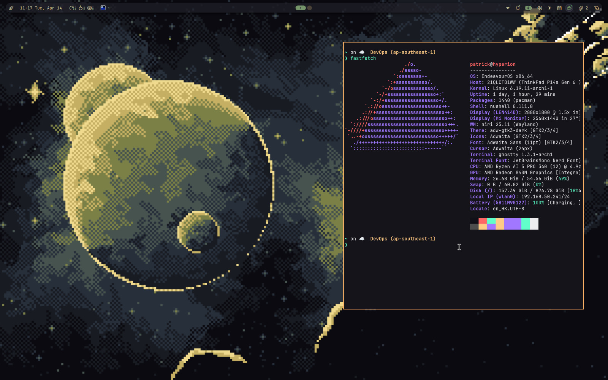

# Hyperion — EndeavourOS Community Edition

> **⚠️ Work in Progress**: This project is currently under active development. Features and configurations may change.

Hyperion is a custom [EndeavourOS Community Edition](https://github.com/EndeavourOS-Community-Editions) built around the [Niri](https://github.com/YaLTeR/niri) scrollable-tiling Wayland compositor. It is scripted entirely in [Nushell](https://www.nushell.sh/) using a shared glue library, rather than the traditional bash approach used by other CEs.

📖 **[Installation Guide](INSTALLATION.md)** - Step-by-step instructions with screenshots



---

## What's included

| Component       | Choice                                                             |
| --------------- | ------------------------------------------------------------------ |
| Compositor      | [Niri](https://github.com/YaLTeR/niri) (scrollable tiling Wayland) |
| Display Manager | SDDM                                                               |
| Shell           | [Noctalia](https://github.com/noctalia-dev/noctalia-shell)         |
| Terminal        | [Ghostty](https://ghostty.org/)                                    |
| File Manager    | Nautilus (GNOME Files)                                             |
| Default Shell   | Nushell                                                            |

---

## Directory structure

```
hyperion/
├── configs/
│   ├── ghostty/        # Ghostty terminal config
│   ├── niri/           # Niri compositor config (output blocks stripped — add your own)
│   ├── noctalia/       # Noctalia shell config (plugins cleared)
│   └── sddm/           # SDDM theme (eos-breeze with night-sky background)
├── glue/
│   └── mod.nu          # Local copy of the shared Nushell glue library
├── images/             # Wallpapers, copied to ~/Pictures/Wallpapers
├── test/
│   ├── Dockerfile      # EndeavourOS-based Docker image for testing
│   └── test.nu         # Test runner script
├── hyperion.nu         # Main install script (Nushell)
├── hyperion.sh         # Manual post-install entry point (bash → hands off to hyperion.nu)
└── setup_hyperion_isomode.bash  # EOS Welcome app entry point (ISO mode)
```

---

## How it works

### Entry points

There are two bash entry points, both of which bootstrap Nushell and then hand off to `hyperion.nu`:

**ISO mode** (called by the EOS Welcome app during a live install):

```bash
# Paste this URL into the EOS Welcome app
https://github.com/patrixr/hyperion/releases/latest/download/setup_hyperion_isomode.bash
```

**Manual install** (after installation):

```bash
# Install latest stable release
curl -sL https://github.com/patrixr/hyperion/releases/latest/download/hyperion.sh | sudo bash

# Install a specific version
curl -sL https://github.com/patrixr/hyperion/releases/download/v0.1.1/hyperion.sh | sudo bash
```

Both scripts:

1. Clone or use the local repo
2. Install Nushell via pacman if not already present
3. Run `hyperion.nu` as root with the target username passed via `$HYPERION_USER`

### The install script (`hyperion.nu`)

The real work happens in `hyperion.nu`, which:

1. **Install packages** — `nushell`, `sddm`, `niri`, `ghostty`, and `noctalia-shell`
   - `noctalia-shell` is only available in [Chaotic-AUR](https://aur.chaotic.cx/). It is installed with Chaotic-AUR temporarily enabled, then **`/etc/pacman.conf` is restored to its original state** afterwards (even on failure).
2. **Set Nushell as the default shell** — registers it in `/etc/shells` and runs `chsh`
3. **Enable SDDM** — via `systemctl enable sddm`
4. **Deploy configs** — copies `configs/niri`, `configs/noctalia`, and `configs/ghostty` to both `~/.config/` and `/etc/skel/.config/` (so future users get the same setup)
5. **Deploy SDDM theme** — installs the custom SDDM theme to `/usr/share/sddm/themes/hyperion` and configures SDDM to use it
6. **Copy wallpapers** — deploys `images/` to both `~/Pictures/Wallpapers` and `/etc/skel/Pictures/Wallpapers`, and creates Noctalia wallpaper configuration with `bg-1.png` as default

### Configs

- **Niri** — monitor/output blocks have been removed. Niri will auto-detect monitors by default. Add your own `output` sections to `~/.config/niri/config.kdl` after install if you need specific configuration (run `niri msg outputs` to see monitor names).
- **Noctalia** — plugin sources are kept, but no plugins are enabled by default. Enable them through the Noctalia UI after install. Default wallpaper is set to `bg-1.png`.
- **Ghostty** — includes the Aura theme with opacity and font settings.
- **SDDM** — based on [SilentSDDM](https://github.com/uiriansan/SilentSDDM) by uiriansan (GPL-3.0), customized with `bg-1.png` background.

---

## Tested Devices

| CPU | GPU | RAM | EndeavourOS | Status |
|-----|-----|-----|-------------|--------|
| AMD Ryzen AI 5 PRO 340 w/ Radeon 840M | AMD Radeon 840M | 54GB | Titan (2026.03.06) | ✅ Working |

---

## Acknowledgments

### Open Source Projects

Hyperion incorporates and builds upon the following open source projects:

- **[SilentSDDM](https://github.com/uiriansan/SilentSDDM)** by [uiriansan](https://github.com/uiriansan) (GPL-3.0) - SDDM login theme
- **[Niri](https://github.com/YaLTeR/niri)** by YaLTeR - Scrollable-tiling Wayland compositor
- **[Noctalia Shell](https://github.com/noctalia-dev/noctalia-shell)** by noctalia-dev - Wayland shell
- **[Ghostty](https://ghostty.org/)** by Mitchell Hashimoto - Terminal emulator
- **[Nushell](https://www.nushell.sh/)** - Modern shell written in Rust

### Wallpaper Artists

The bundled wallpapers in `images/` are used with permission or under their respective licenses:

| File | Title | Artist | Source | License |
|------|-------|--------|--------|---------|
| `bg-1.png` | [Final Frontier](https://www.deviantart.com/prisonercoin/art/Final-Frontier-918347015) | [prisonercoin](https://www.deviantart.com/prisonercoin) | DeviantArt | Exclusive Adoptable — commercial use rights owned |
| `bg-2.jpg` | [Parallels](https://unsplash.com/photos/person-sitting-on-brown-sand-under-starry-night-lakRKK8DDiw) | [Jacob Granneman](https://unsplash.com/@jgranneman) | Unsplash | [Unsplash License](https://unsplash.com/license) |
| `bg-3.jpg` | [Starry Night](https://unsplash.com/photos/the-night-sky-is-filled-with-stars-and-a-lone-tree-K-ENC7LNABA) | [Thomas Chizzali](https://unsplash.com/@tchizzali) | Unsplash | [Unsplash License](https://unsplash.com/license) |
| `bg-4.png` | [Pridwen](https://www.deviantart.com/prisonercoin/art/Pridwen-920040742) | [prisonercoin](https://www.deviantart.com/prisonercoin) | DeviantArt | Exclusive Adoptable — commercial use rights owned |
